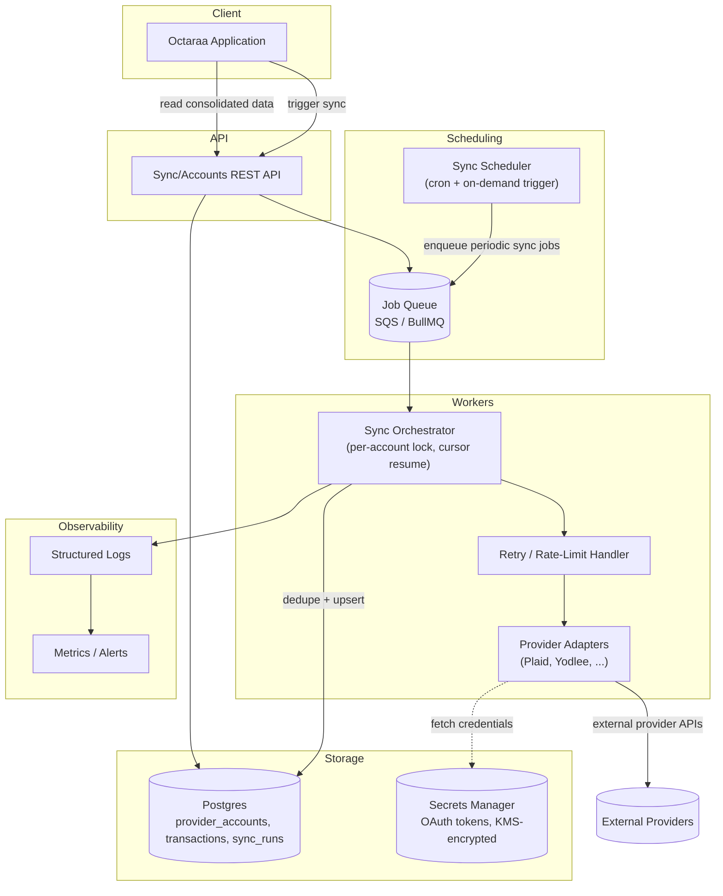

# Architecture Diagram

This is the target shape at scale (see `docs/technical-note.md` §2–3). What's
actually running today (`npm start`) is the single-process form: the Scheduler
box below is a real `node-cron` job, but it calls the Orchestrator directly —
no Job Queue, no separate Workers yet. The API box is real but minimal
(`GET /health`, `POST /sync/trigger`, `GET /sync/status`), not the full
consolidated-data read API shown here.

